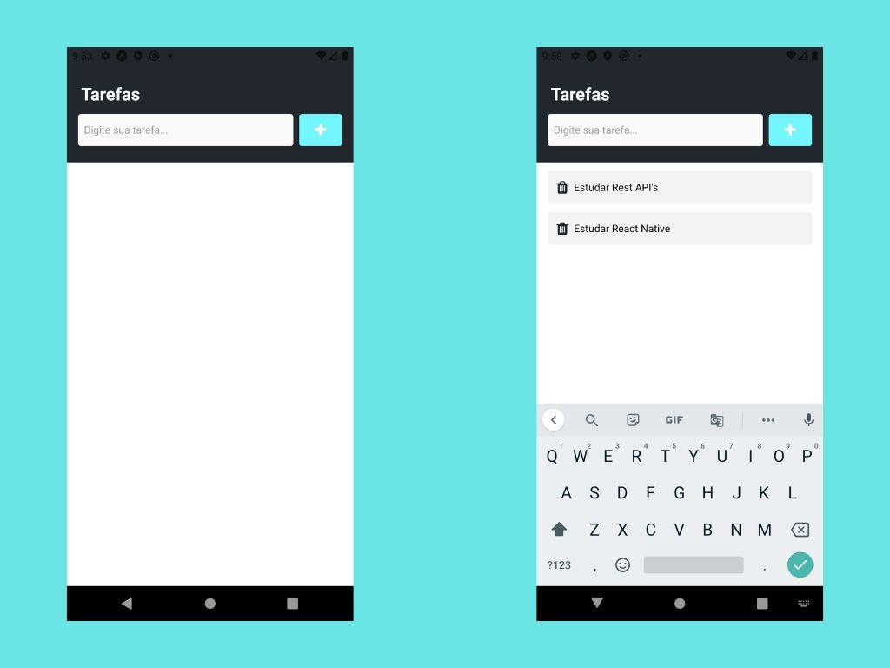

<div style="display: flex; flex-direction: column; text-align: center;">
    <h1>Tarefas - To Do List</h1>
    
</div>

## Sumário

- [\[Tarefas\]](#)
  - [Sumário](#sumário)
  - [Introdução](#Introdução)
  - [Tecnologias Usadas](#tecnologias-usadas)
  - [Princípais funcionalidades](#princípais-funcionalidades)
  - [Pré Requisitos](#pré-requisitos)
  - [Como Executar o Projeto](#como-executar-o-projeto)
  - [Contato](#contato)

## Introdução

Este repositório contém um pequeno projeto de um aplicativo de gerenciamento de tarefas para dispositivos móveis.

## Tecnologias Usadas

- **Linguagem**: JavaScript (ES6)
- **Framework**: React Native
---

## Princípais funcionalidades

### 1. **Tarefas**
- **Criar tarefas**: Os usuários podem cadastrar tarefas
- **Excluir Tarefas**: Os usuários podem excluir as tarefas criadas.

## Como Executar o Projeto

### Pré-requisitos
- Node.js (v18 ou superior)
- Android Studio com Android 10 ou superior / Smartphone Android com Expo Go

### Passos para Executar

1. **Clone o repositório**:
    ```bash
    git clone https://github.com/LucasDoGit/full-stack-pro-projetos
    cd react-native/tarefas
    ```

2. **Instale as dependências**:
    ```bash
    npm install
    ```

3. **Execute o projeto**
    ```bash
    npx expo start
    ```

3. **Acesse pelo emulador**
    - Digite *A* na linha de comando para abrir o emulador no **Android Studio**.

## Contato

Para obter mais informações, entre em contato comigo em:

- Email: lucas.saiz19@gmail.com
- GitHub: https://github.com/LucasDoGit